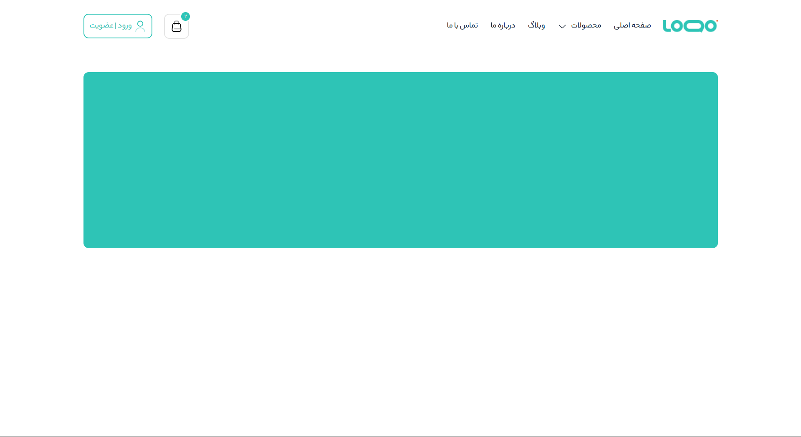
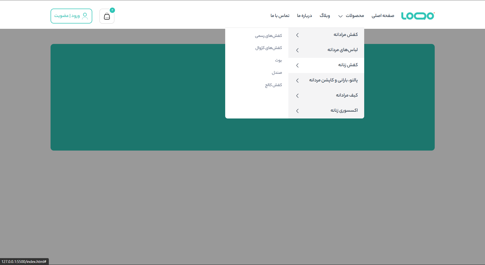
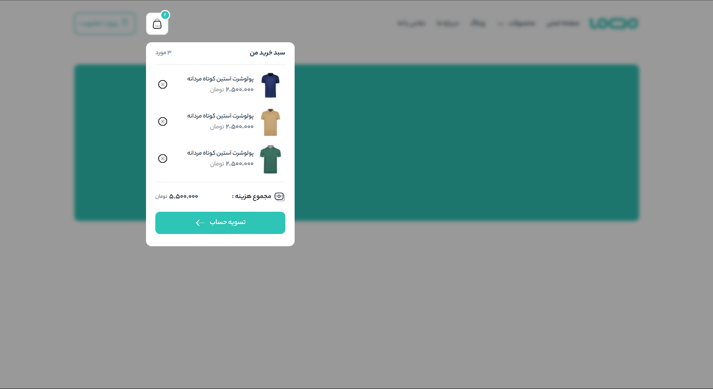
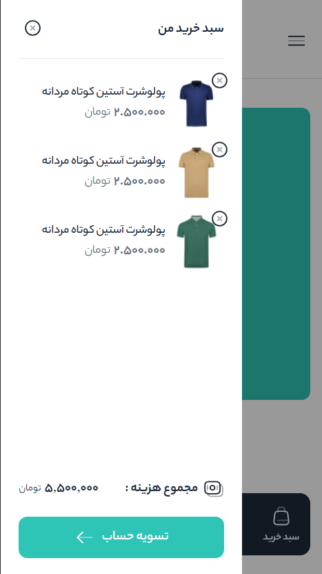
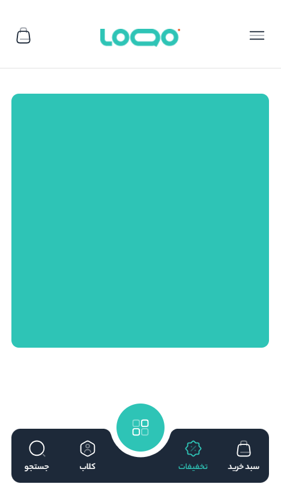
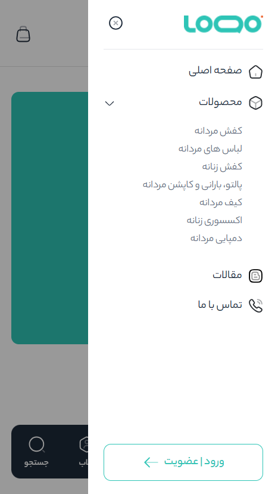

# 🚀 Responsive Mega Menu - Modern Navigation Solution

A fully responsive mega menu solution for e-commerce and corporate websites, built with modern web technologies.

<br>

### 🖥️ **Desktop View**

<p align="center">
  
  
  
</p>

### 📱 **Mobile View**

<p align="center">
  
  
  
</p>

<br>

## 🛠 Technologies Used

| Technology | Purpose |
|------------|---------|
|  | Core structure |
|  | Styling and animations |
|  | Interactions and logic |
|  | Vector icons and graphics |

<br>

## ✨ Key Features

- 🌐 **Fully Responsive** - Perfect display on all devices from mobile to desktop
- 🎯 **Interactive Mega Menu** with smooth hover effects
- 🛒 **Dynamic Shopping Cart** with item display and auto calculation
- 📱 **Optimized Mobile Menu** with professional UX/UI
- ⚡ **SVG Icons** - High quality and lightweight

<br>

## 🚀 Quick Start

1. **Clone the project**:

   ```bash
   git clone https://github.com/Shahzadhpr/Menu-Megamenu.git
   cd Menu-Megamenu

2. **Install fonts**:

    Download Yekan Bakh fonts from fontiran.com
    
    Place font files in the fonts directory

3. **Run the project**:

    Open index.html in your browser

  <br>

## 📝 License

This project is licensed under the **MIT License**.  
See the [LICENSE](./LICENSE) file for full details.  


  <br>

## 📬 Contact Me

Feel free to reach out through any of the following platforms :

[](https://www.linkedin.com/in/hassanpourshahzad)  [](https://wa.me/989112874119)  [](https://t.me/Shahzad_hpr)  

<br>

## 🙏 Thank You

Thank you for visiting this repository. I hope you find it useful and inspiring.  
Feel free to leave a star ⭐ or provide feedback!

<p>Developed with love by <a href="https://github.com/Shahzadhpr" style="color:#2EC4B6; font-weight:bold;">Shahzad Hassanpour ❤️</a></p>
